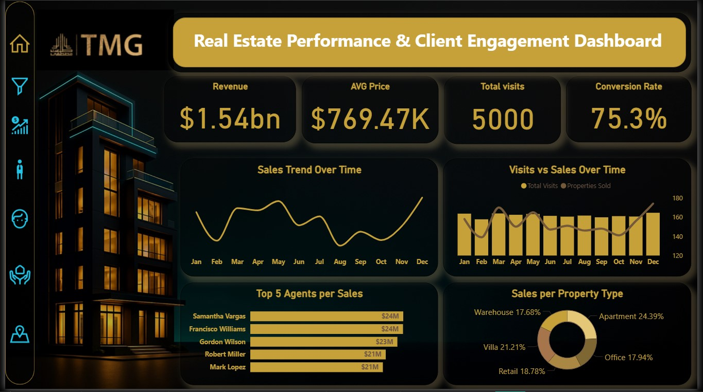
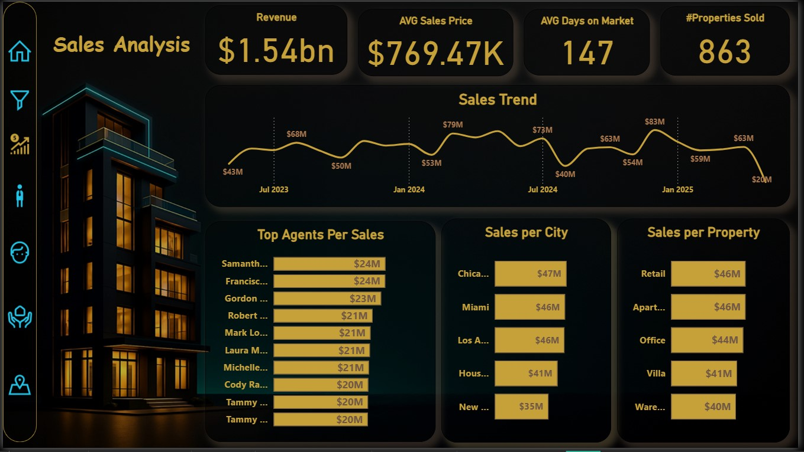
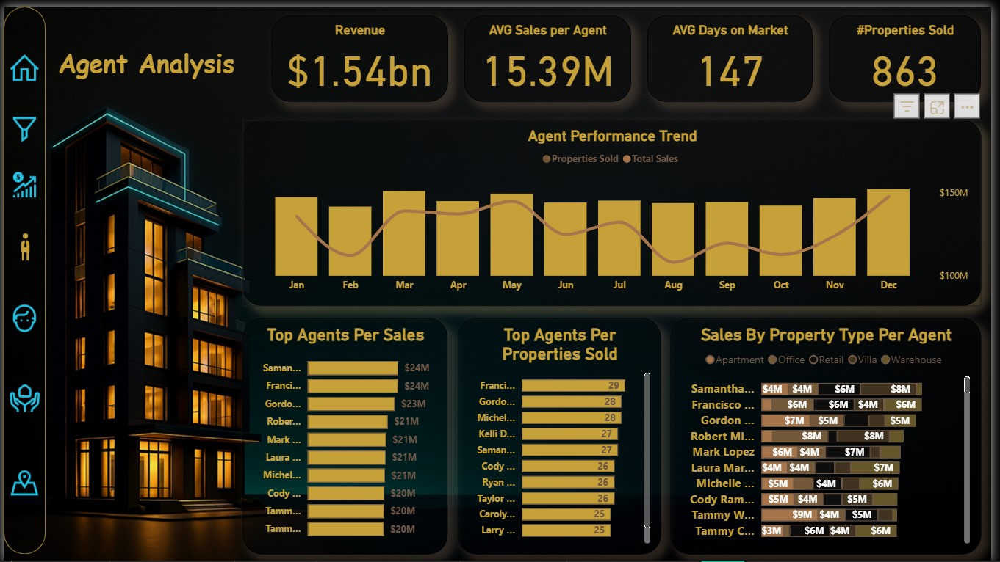
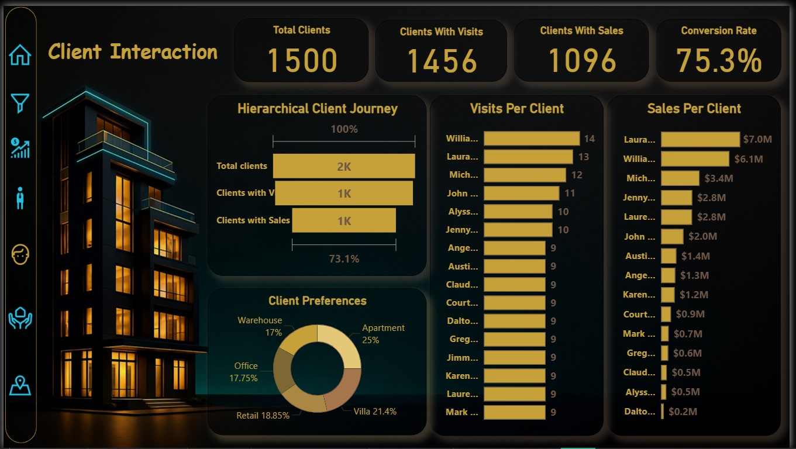
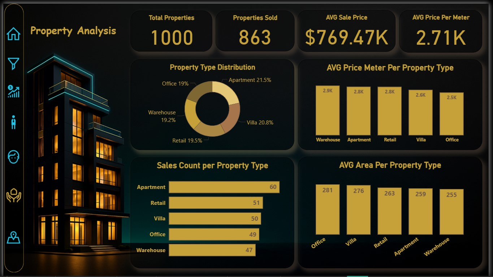
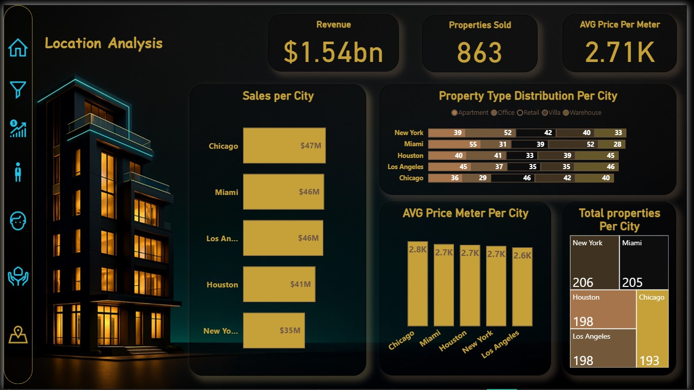

# Real Estate Analytics — Project Documentation

## 📌 Overview
مشروع تحليل بيانات وكالة عقارية بهدف بناء داشبورد Power BI يعرض أداء المبيعات، الوكلاء، العقارات، العملاء، والمواقع.

الملف يحتوي على: توثيق البيانات، خطوات التنظيف، نموذج البيانات، المقاييس، وصور الداشبورد.

---

## 📁 محتويات المشروع
- `Realestate.pbix` — ملف Power BI النهائي.
- `data/RealEstateAgencyData.xlsx` — البيانات المصدر.
- `docs/` — ملفات التوثيق (تنظيف الداتا، DAX، النموذج).
- `screenshots/` — صور الداشبورد.
- `README.md` — هذا الملف.

---

## 🎯 أهداف المشروع
1. تحليل أداء المبيعات والوكالات.
2. متابعة مؤشرات الأداء (KPIs):
   - Total Sales
   - Conversion Rate
   - Avg Price per m²
   - Days on Market
3. دعم اتخاذ القرار في التسعير وتخصيص الوكلاء.

---

## 🔍 بيانات المصدر
**الملف:** `RealEstateAgencyData.xlsx`

**الجداول:**
- Properties
- Sales
- Clients
- Agents
- Visits
- Calendar

**مشاكل تمت معالجتها:**
- Duplicate clients
- Missing dates
- Data type inconsistencies
- تحويل السعر من Text → Decimal

---

## 🧼 خطوات تنظيف البيانات (Power Query)
- توحيد أنواع البيانات
- إزالة الصفوف والأعمدة غير الضرورية
- احتساب `Price per m²`
- معالجة Null وDuplicates
- بناء جدول Calendar

**ملف الشرح الكامل:** `docs/data-cleaning.md`

---

## 🧠 نموذج البيانات (Data Model)
**العلاقات الرئيسية:**
- Properties → Sales (1:* )
- Clients → Sales (1:* )
- Agents → Sales (1:* )
- Calendar → Sales (1:* )

مخطط النموذج: `docs/data-model.png`

---

## 📊 مقاييس DAX الأساسية
```DAX
Total Sales = SUM(Sales_New[SalePrice])

Total Properties = COUNTROWS(Properties)

Clients with Sales = DISTINCTCOUNT(Sales_New[ClientID])

Clients with Visits = DISTINCTCOUNT(Visits[ClientID])

Conversion Rate = DIVIDE([Clients with Sales],[Clients with Visits],0) * 100

Avg Price per m2 = AVERAGE(Properties[Price per meter])

Avg Days on Market = AVERAGEX(Sales_New, Sales_New[Days on Market])
```

---

## 📸 Dashboard Preview
### Overview Page
ضع الصورة هنا:




### Sales Page




### Agents Page




### Clients Page




### Property Page




### Location Page




---

## 📝 Insights Summary
- Highest performing agents
- Best selling property types
- Cities with highest price/m²
- Conversion rate trends
- Time on market distribution

(يمكنك تعديل هذه الجزئية بناءً على نتائجك.)

---

## 🚀 How to Use
1. افتح ملف `Realestate.pbix`
2. حدّث مصدر البيانات إذا لزم
3. تصفح الصفحات المختلفة من الداشبورد

---

## 🙌 Author
**Mohamed Heta**

#MAKE_DATA_TALK  
#معلومة_في_السكة

